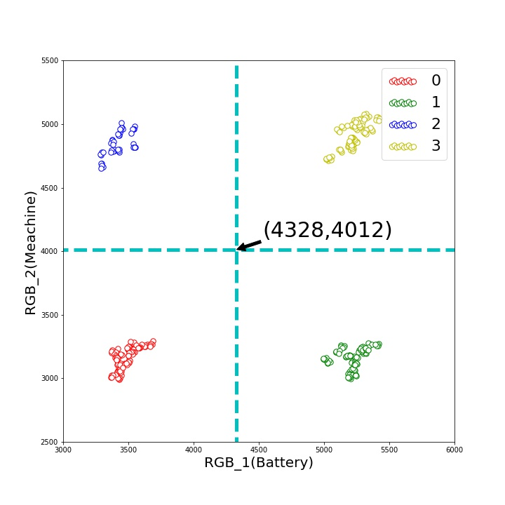
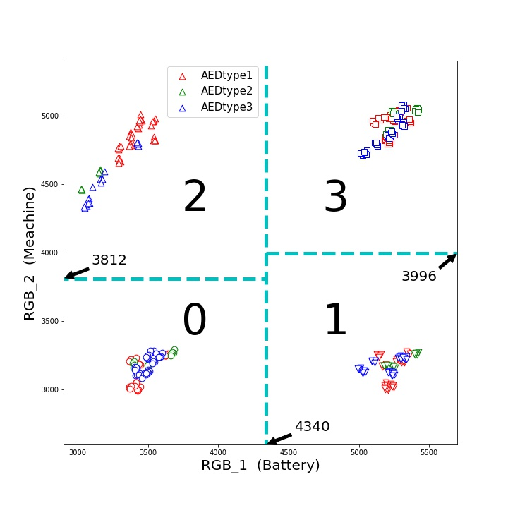
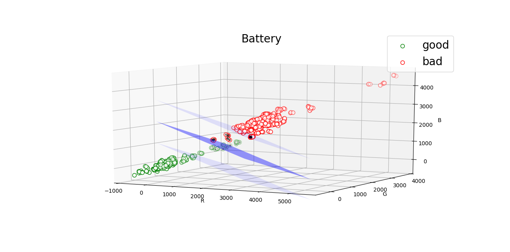
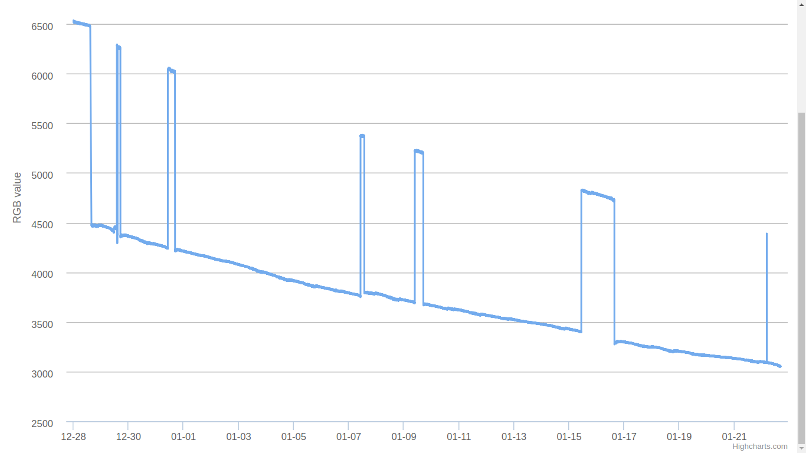
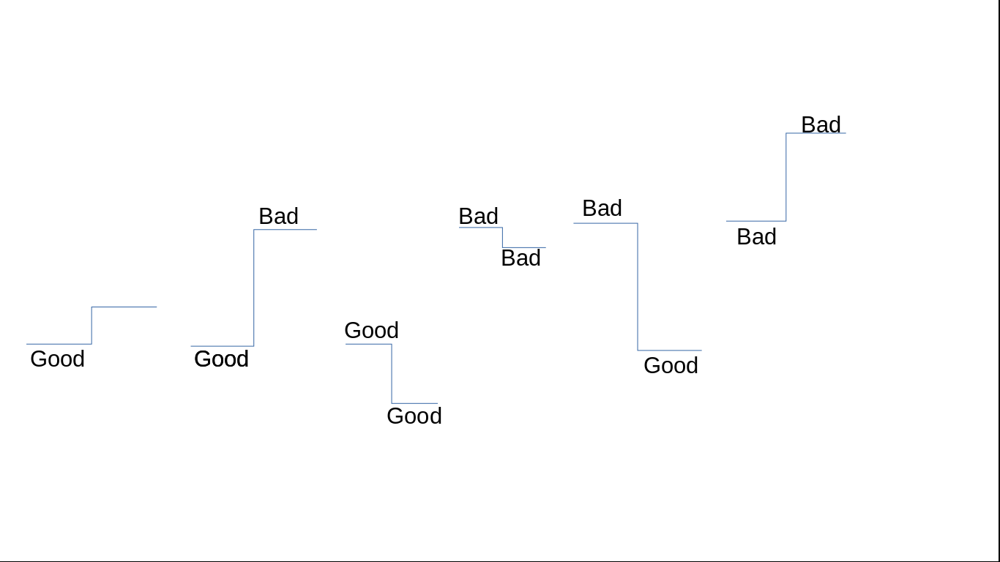

# AED监控

以下3个子目录有用:
* [AED4](AED4) 早期数据采集，及相关统计算法的实现，目前用不到。
* [web](web)  提供API接口
* [display](display)  监控数据可视化访问页面

web和display共用一个数据库(服务器上位于/data/)，其他相互独立。


# 环境配置
* ubuntu 16.04   其他linux操作系统应该也可以，windows也可以(但api接口需要在后台运行，windows下我不会操作)

* Python2.7 

* 相关的库
    * django=1.10.1         提供web框架  	
    * numpy=1.14.0  
    * scikit-learn=0.19.1   如果只使用数值突变的算法，不需要安装。  


# 解决方案
通过控制盒上传的数据，可以得到16个数字。取前12个数字来判断AED电池及设备的状态。由于电池的状态和机器的状态是近似相互独立的，所以可以把电池的状态和设备的状态分开判断，一个状态之和6个数字相关(R值，R校准，G值，G校准，B值，B校准)。


## 直观
早期对十多台AED(3种型号)，少量监控装置，两两组合，得到了一些数据，发现实际值减去校准值的分布有规律可循。下图只是对单独的R通道的可视化，发现不同状态有明显的分隔线



## 进阶

随着监控批次的增多，不同状态间的数据分布很难找到明显的分隔线。

以上的分布我们仅仅是从单个R,单个G,单个B去看的，如果同时考虑RGB三通道，可以得到三维的数据分布，在三维空间很容易用一个平面去划分。平面的选择用到了支持向量机的算法。



## 突变
随着时间的推移，发现监控数值会随着时间衰减(大概需要连续3天以上的持续观察才可以发现)。由于监控的数值正比于LED的反射强度，所以推断是由于LED灯光强的衰减造成的，并且根据相关资料显示LED的衰减呈现指数下降趋势，所以监控数值的衰减曲线极有可能是指数曲线。很不幸，之前设计的算法就不能用了。

仔细观察曲线可以发现，每次状态改变时，数值会有明显的突变,根据几台观测设备采集到的数据发现，故障值/正常值≈1.4，我们可以计算当前值与前一时刻的比值，如果大于设定的阈值，则可认为状态发生了改变，最基本的可能的变化模式有下图的6种。之所以用比值而不用差值，是因为随着数值的下降，差值也会同比例的下降，不易设定一个统一的阈值。


具体在代码层面的体现，由于当前时刻的状态是和之前一段时间的状态有关的，所以很容易迭代，但初始时刻的状态却不知道。可以选择校准时刻为初始时刻，初始状态为正常。在某一时刻获取数据后，查询得到前10个时间点的数据(之所以要利用之前的10组数据，而不是前一时刻的数据，是为了降低干扰)，如果这10组数据的状态都相同，则取它们的平均值作为参考值，去和当前时刻的值做比较，进一步判断出它属于哪一种变化模式。如果10组数据中有故障，也有正常，则分组分别计算正常的平均值和故障的平均值，然后计算它们和当前值的距离，距离近的就可以认为是当前状态。


# 程序运行

```
# 运行api接口，切换至web/my_api/ 路径下 
python manage.py runserver 0.0.0.0:80
#如需后台运行
nohup python manage.py runserver 0.0.0.0:80 &


# 运行数据可视化，切换至display/proj/ 路径下 
python manage.py runserver 0.0.0.0:5000
#如需后台运行
nohup python manage.py runserver 0.0.0.0:5000 &

```


# 代码解释

```
最核心的代码位于[web/my_api/algorithm/views.py](web/my_api/algorithm/views.py)

```
